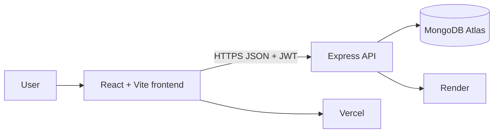

# WealthTrack

**Financial Habit Builder and Wealth Growth Tracker**

WealthTrack is a full-stack personal-finance application for students and young professionals. It combines manual income and expense tracking with financial habits, savings goals, manual asset tracking, and visual wealth analytics. The app is INR-first and intentionally does not require bank credentials or bank-account integration.

## Live Project

| Resource | Link |
| --- | --- |
| Live application | [financial-habit-tracker-client.vercel.app](https://financial-habit-tracker-client.vercel.app) |
| API health check | [financial-habit-tracker.onrender.com/api/health](https://financial-habit-tracker.onrender.com/api/health) |
| GitHub repository | [SarthakBaghel/financial-habit-tracker](https://github.com/SarthakBaghel/financial-habit-tracker) |
| Detailed project report | [docs/project-report.md](docs/project-report.md) |

## Problem Statement

Many people find it difficult to save regularly, control spending, and understand their overall financial position. Most personal-finance tools focus only on budgets or transactions. WealthTrack complements transaction tracking with a habit-building layer so users can make financial actions, savings goals, and longer-term wealth progress visible in one place.

## What the Application Delivers

- Secure registration, login, logout, protected routes, and role-based admin access.
- Manual income and expense tracking with categories, filters, editing, deletion, and monthly summaries.
- Financial habits with daily, weekly, or monthly frequency, completion logging, streaks, and progress metrics.
- Savings goals with target amounts, deadlines, updates, status, and percentage completion.
- Manual savings, investment, and asset tracking for wealth-growth and net-worth views.
- A dashboard with total income, expenses, net savings, savings rate, active habits, goals, recent transactions, charts, monthly targets, and concise monthly insights.
- A financial baseline that compares current-month income and savings with profile targets and reports `On track`, `Behind target`, `Target met`, or `Set targets`.
- Wealth analytics for net-worth trend, income versus expenses, savings goals, habit completion, and data-driven insights.
- A basic admin area for platform usage, users, transactions, habit completion, goal completion, and feedback issues.
- Responsive, calm dashboard UI with INR as the default currency.

## Core User Flow

1. Visit the public landing page and create an account.
2. Register with name, email, password, and preferred currency.
3. Complete the optional financial baseline: monthly income target, savings target, risk preference, and a primary goal.
4. Add income and expense records.
5. Create habits and mark them complete to build streaks.
6. Create savings goals and update progress.
7. Add manual savings, investments, or other assets.
8. Review dashboard totals, monthly insights, charts, goals, and wealth growth.

## Financial Baseline and Monthly Insights

The profile baseline is a reference, not a bank connection or automated financial-advice engine. It is used to give current-month records context:

- **Income target:** compares income recorded this month with the saved monthly income target.
- **Savings target:** compares this month's net savings (income minus expenses) with the saved savings target.
- **Dashboard status:** uses the current day of the month and target progress to show `On track`, `Behind target`, or `Target met`.
- **Monthly insight cards:** show the current-month expense share of recorded income and the remaining amount needed for the savings target.

Actual financial totals always come from the records entered by the user. Saving a profile baseline does not create transactions, transfer money, or provide investment advice.

## Technology Stack

| Layer | Technology |
| --- | --- |
| Frontend | React 18, Vite, Tailwind CSS, React Router |
| Visualisation and motion | Recharts, GSAP, Lucide React |
| Backend | Node.js, Express |
| Database | MongoDB with Mongoose; MongoDB Atlas in production |
| Authentication | bcryptjs password hashing and JWT bearer tokens |
| Security | Helmet, CORS allowlist, protected routes, role checks |
| Frontend hosting | Vercel |
| API hosting | Render |
| Validation | Node API-flow validation, ESLint, Vite production build |

## Architecture



The browser stores the authenticated session token and sends it as a bearer token on protected API requests. The Express API validates the token, scopes queries to the signed-in user, and reads or writes MongoDB documents.

## Project Structure

```text
.
├── client/                         # React frontend
│   ├── src/pages/                  # Landing, auth, dashboard, feature pages
│   ├── src/components/             # Shared UI and dashboard components
│   ├── src/layouts/                # Public/authenticated application shells
│   └── src/services/api.js         # Axios API client
├── server/                         # Express API
│   ├── src/controllers/            # Feature and aggregation logic
│   ├── src/models/                 # Mongoose schemas
│   ├── src/routes/                 # REST API routes
│   ├── src/middleware/             # Auth, role, error middleware
│   └── scripts/                    # Demo seed and validation scripts
├── docs/                           # Supporting module and submission notes
├── render.yaml                     # Render Blueprint
├── vercel.json                     # Vercel build and SPA-routing configuration
└── README.md                       # Complete root project documentation
```

## Feature Modules

### Authentication and Profile

- Email/password registration and login.
- Passwords hashed with bcryptjs.
- JWT token generation and protected routes.
- User roles: `user` and `admin`.
- Profile baseline with income target, savings target, risk preference, and financial goal.

### Transactions

- Add, edit, and delete income or expense records.
- Expense categories: Food, Rent, Transport, Shopping, Bills, Health, Education, Entertainment, and Other.
- Filter records by month, category, and type.
- Monthly summaries and dashboard calculations.

### Habits

- Create habits with daily, weekly, or monthly frequency.
- Log completions, track streaks, and view completion progress.
- Supports routines such as logging expenses, reviewing a budget, saving money, or checking a goal.

### Savings Goals

- Create and manage financial goals.
- Track target amount, saved amount, deadline, category, and completion status.
- Display goal progress and remaining amount.

### Wealth and Analytics

- Add manual savings, investment, and asset values.
- Calculate manual asset value, net savings, and net worth.
- Visualise wealth growth, monthly expenses, category spending, income versus expenses, goal progress, and habit completion.

### Admin Dashboard

- View total users, active users, transactions, habits, goals, and engagement metrics.
- Review users and feedback/issues.
- Update feedback status.

## Data Model

| Collection | Purpose | Key Fields |
| --- | --- | --- |
| `users` | Identity and access | name, email, passwordHash, role, currencyPreference |
| `profiles` | Personal financial baseline | monthlyIncomeTarget, savingsTarget, riskPreference, financialGoals |
| `transactions` | Manual income and expenses | type, category, amount, date, note |
| `habits` | Habit definitions | habitName, frequency, target, streak, status |
| `habitLogs` | Completion history | habitId, userId, date, completed |
| `savingsGoals` | Goal progress | title, targetAmount, currentAmount, deadline, status |
| `assets` | Manual wealth entries | name, type, value, date |
| `feedback` | Admin-review items | message, status |

Every user-owned collection contains a `userId`. Amounts cannot be negative, and all private data routes require a valid JWT.

## API Overview

Base URL in production: `https://financial-habit-tracker.onrender.com/api`

Protected endpoints require:

```http
Authorization: Bearer <JWT>
```

| Area | Endpoints |
| --- | --- |
| Health | `GET /health` |
| Auth | `POST /auth/register`, `POST /auth/login`, `GET /auth/me` |
| Profile | `PUT /profile` |
| Dashboard | `GET /dashboard/overview` |
| Transactions | `GET/POST /transactions`, `GET /transactions/summary`, `PUT/DELETE /transactions/:id` |
| Habits | `GET/POST /habits`, `GET /habits/summary`, `PUT/DELETE /habits/:id`, `POST /habits/:id/log` |
| Savings goals | `GET/POST /savings-goals`, `PUT/DELETE /savings-goals/:id`, `PATCH /savings-goals/:id/progress` |
| Assets | `GET/POST /assets`, `PUT/DELETE /assets/:id` |
| Analytics | `GET /analytics/wealth` |
| Admin | `GET /admin/summary`, `GET /admin/users`, `GET /admin/feedback`, `PATCH /admin/feedback/:id` |

Admin endpoints also require the authenticated user to have `role: admin`.

## Run Locally

### Prerequisites

- Node.js 20 or newer.
- npm 9 or newer.
- MongoDB running locally, or a MongoDB Atlas connection string.

### 1. Install dependencies

```bash
npm install
```

### 2. Create environment files

```bash
cp client/.env.example client/.env
cp server/.env.example server/.env
```

### 3. Configure environment variables

`client/.env`

```env
VITE_API_BASE_URL=http://localhost:5001/api
```

`server/.env`

```env
PORT=5001
NODE_ENV=development
CLIENT_ORIGIN=http://localhost:5173
MONGODB_URI=mongodb://127.0.0.1:27017/wealth_growth_tracker_um
JWT_SECRET=replace-with-a-long-random-secret
DEMO_EMAIL=demo@wealthtrack.app
DEMO_PASSWORD=WealthTrackDemo123!
```

### 4. Start the frontend and backend

```bash
npm run dev
```

| Service | Local URL |
| --- | --- |
| Frontend | `http://localhost:5173` |
| API health check | `http://localhost:5001/api/health` |

Useful individual commands:

```bash
npm run dev:client
npm run dev:server
npm run build
npm run lint
npm test
```

## Demo Data

Seed a realistic INR demo account after configuring the target MongoDB connection:

```bash
npm run seed:demo --workspace server
```

Default demo credentials:

```text
Email: demo@wealthtrack.app
Password: WealthTrackDemo123!
```

The seed command resets only this demo account and creates transactions, habits, goals, assets, and baseline values. Set `DEMO_EMAIL` and `DEMO_PASSWORD` before running the command to use different demo credentials.

## Testing and Validation

Run the full validation suite:

```bash
npm test
```

It performs the following checks:

- Backend health endpoint and protected-route access.
- Register, login, session, validation, and duplicate-email flows.
- Profile persistence and baseline dashboard calculations.
- Transaction, habit, savings goal, asset, analytics, and admin workflows.
- Client ESLint checks.
- Vite production build.

## Deployment

### MongoDB Atlas

1. Create a MongoDB Atlas cluster and database user.
2. Add the connection string to Render as `MONGODB_URI`.
3. For this demo deployment, allow the Render service to connect through the Atlas project IP access list. For a production system, use more restrictive network controls.

### Render API

The repository includes [render.yaml](render.yaml). Create a Render Blueprint or Web Service from the repository root.

| Render setting | Value |
| --- | --- |
| Build command | `npm ci` |
| Start command | `npm run start --workspace server` |
| Health check | `/api/health` |
| Required variables | `MONGODB_URI`, `JWT_SECRET`, `CLIENT_ORIGIN`, `NODE_ENV=production` |

Do not define `PORT`; Render provides it automatically.

### Vercel Frontend

Deploy from the repository root. [vercel.json](vercel.json) builds `client/` and preserves React client-side routes.

Set this Vercel environment variable:

```env
VITE_API_BASE_URL=https://financial-habit-tracker.onrender.com/api
```

Set Render's `CLIENT_ORIGIN` to the exact Vercel production URL:

```env
CLIENT_ORIGIN=https://financial-habit-tracker-client.vercel.app
```

Redeploy each service after changing its environment variables.

## Security and Scope Notes

- Passwords are never stored in plain text.
- JWT-protected API routes enforce authentication; admin routes require the admin role.
- The API uses Helmet and a configured CORS origin.
- WealthTrack stores manual user entries only. It does not request bank credentials.
- It is an educational finance-tracking application, not financial advice.
- Bank sync, automatic transaction import, investment trading, push notifications, automated reports, and AI financial advice are intentionally out of scope for this release.

## Future Enhancements

- Bank account integration and automated categorisation.
- Optional scheduled reminders and notifications.
- More personalised habit recommendations using the saved baseline.
- Downloadable financial reports.
- Native mobile application.
- More granular production network controls and private database connectivity.

## Project Submission Checklist

- [x] Public GitHub repository.
- [x] Vercel frontend deployment.
- [x] Render backend deployment and health endpoint.
- [x] MongoDB Atlas database.
- [x] Root README with setup, features, API, deployment, testing, and demo details.
- [ ] Public project-feedback video link.

## Author

Sarthak Baghel
